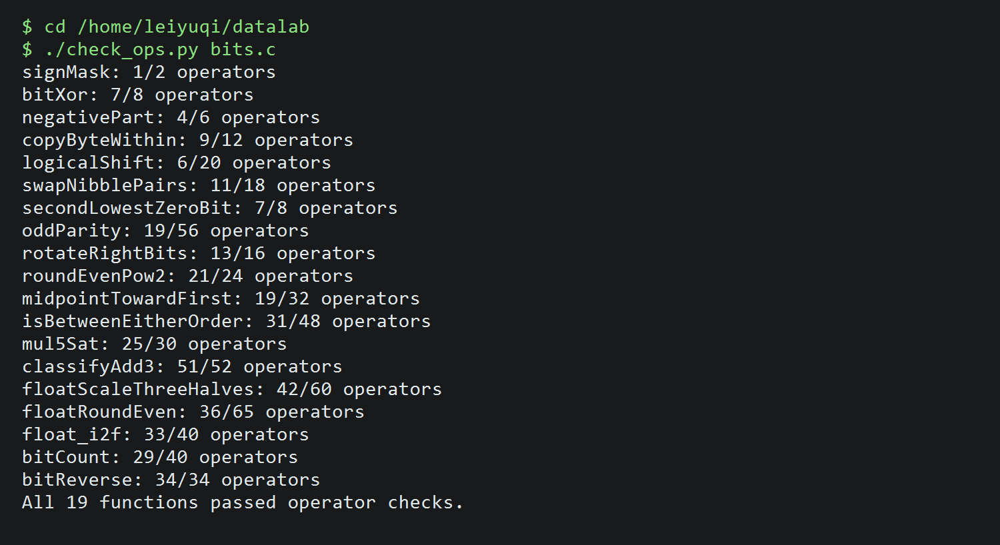
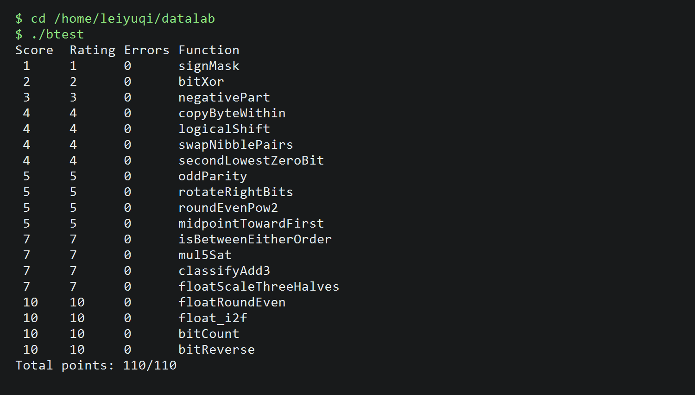

# Lab 1：Data Lab 实验报告

## 基本信息

- 实验标题：Lab 1：Data Lab
- 姓名：bieguang22
- 学号：1956372662
- 实验目录：`/home/leiyuqi/datalab`

## 实验结果

### `./check_ops.py bits.c`

下图为在 WSL 终端中执行规则检查的结果。19 个函数均通过合法运算符与操作数上限检查。



最终输出为：

```text
All 19 functions passed operator checks.
```

### `./btest`

下图为在 WSL 终端中执行完整功能测试的结果。



最终输出为：

```text
Total points: 110/110
```

## 函数实现思路

### P1–P9：基础位运算

1. **`signMask`**：将 `1` 左移 31 位，得到最高位掩码 `0x80000000`。
2. **`bitXor`**：利用德摩根定律，将异或表示为两个与运算及取反运算的组合。
3. **`negativePart`**：通过算术右移得到符号掩码；对输入取补码后与符号掩码相与，保证非负数返回 0。
4. **`copyByteWithin`**：根据字节编号计算移位量，提取源字节，构造目标字节掩码后先清除目标位置，再写入源字节。
5. **`logicalShift`**：先进行算术右移，再构造低位有效掩码，去除算术右移产生的高位符号扩展。
6. **`swapNibblePairs`**：构造每个字节低四位组成的掩码，分别提取高、低半字节并交换位置。
7. **`secondLowestZeroBit`**：先对输入取反，把 0 位转成 1 位；清除最低位的 1 后，再提取新的最低位 1。
8. **`oddParity`**：通过分组异或折叠，将 32 位逐步压缩到 1 位；最后根据题意对结果取反，得到偶校验对应的返回值。
9. **`rotateRightBits`**：把旋转量限制到 0–31，使用逻辑右移部分和左移补入部分进行或运算；对旋转量为 0 的情况将左移量也限制到合法范围。

### P10–P14：舍入、比较与溢出

10. **`roundEvenPow2`**：将输入拆成商和余数，比较余数与半单位的关系；大于半单位时进位，恰好相等时根据商的奇偶性决定是否进位。
11. **`midpointTowardFirst`**：使用 `(x & y) + ((x ^ y) >> 1)` 计算不溢出的平均值；当两数奇偶性不同且第一个参数较大时补 1，使结果靠近第一个参数。
12. **`isBetweenEitherOrder`**：分别计算 `x-a`、`x-b` 的数学符号，并修正不同符号相减时可能出现的机器溢出；若两端位于相反侧或恰好等于端点，则返回 1。
13. **`mul5Sat`**：先连续计算 `2x`、`4x` 和 `5x`，检查每一步的符号变化；溢出时根据输入符号选择 `INT_MAX` 或 `INT_MIN`。
14. **`classifyAdd3`**：用无符号进位关系记录两次加法的高位，再减去负数参数的数量，得到精确和相对于 32 位范围的高位；据此区分正溢出、负溢出和不溢出。

### P15–P17：浮点位级操作

15. **`floatScaleThreeHalves`**：拆分符号、阶码和尾数。非规格化数直接对尾数乘 3 后除以 2，并按偶数舍入；规格化数根据乘积大小选择除以 2 或除以 4，同时调整阶码；NaN 和无穷大保持不变。
16. **`floatRoundEven`**：对有限浮点数按阶码判断其绝对值是否小于 1、已经是整数或需要舍入；对尾数的余数、半单位和最低有效位进行偶数舍入，再重新编码为浮点整数。
17. **`float_i2f`**：处理 0、符号和绝对值，寻找最高有效位作为阶码；保留 23 位尾数，并依据被截去部分与半单位进行 round-to-nearest-even。

### P18–P19：位计数与位反转

18. **`bitCount`**：依次使用 `0x55`、`0x33`、`0x0f` 形式的分组掩码，完成 1 位、2 位、4 位分组的并行计数，最后合并高位分组。
19. **`bitReverse`**：从 `0xffff` 掩码开始，通过异或和移位依次生成 8 位、4 位、2 位和 1 位交换掩码；按 16、8、4、2、1 位逐级交换，完成 32 位反转，并控制在 34 个操作以内。

## 引用与参考资料

1. 实验仓库中的 `README.md`：题目说明、编码限制、输入约束和测试方法。
2. 实验仓库中的 `bits.c` 函数注释：各题的具体语义、合法运算符和操作数上限。
3. 实验仓库中的 `check_ops.py`、`dlc` 和 `btest`：规则检查与功能测试工具。

本报告没有使用其他外部资料。

## 实验感受

本实验让我更熟悉了二进制补码、算术移位、掩码构造和溢出判断。整数题看似只需要少量运算，但边界值会显著影响实现；浮点题则需要同时考虑非规格化数、NaN、无穷大以及 round-to-nearest-even。通过 `check_ops.py` 与 `btest` 的配合，可以分别定位代码规范问题和功能正确性问题。

## 对助教的建议

建议在测试失败信息中额外标注对应的边界类别，例如“负数算术右移”“舍入中点”“阶码溢出”等，这样更容易从失败样例快速定位实现思路。
